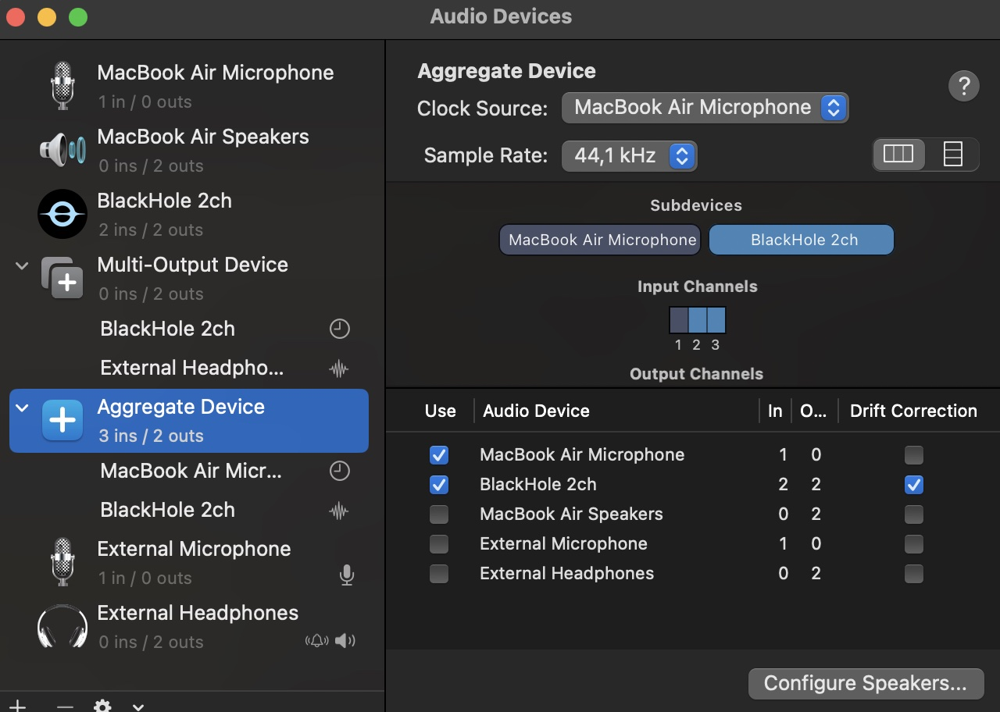
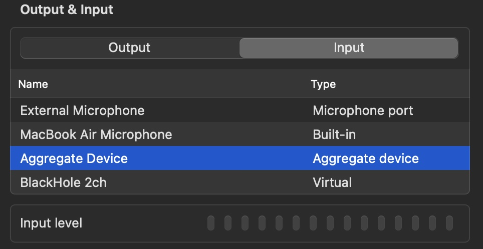

## Using Internal Audio together with Microphone input and a input device on MacOS

In this blog post we will discover how to easily record internal audio together with microphone input on the MacOS Apple Operating System.
Only open source software will be required, together with the tools that Apple provides.
That means this method will work system-wide: You can still use QuickTime, or any other Application with sound input.

This will hence also work on video-conferencing software like Zoom or Google Meet.
I tested this on my M1 Macbook Air running the latest MacOS Ventura, so this is confirmed to work on all recent Apple Mac systems.
Let's have a look how this works.

### Required software

The only required software is an audio driver, called [BlackHole (Open Source)](https://github.com/ExistentialAudio/BlackHole).
The best way to install it is through [Homebrew](https://brew.sh/).
Homebrew is incredibly handy for a lot of things, so it is a good idea to leave this package manager installed.

If you don't have Homebrew install it according to [the official instructions](https://brew.sh/):

```
/bin/bash -c "$(curl -fsSL https://raw.githubusercontent.com/Homebrew/install/HEAD/install.sh)"
```

Then install the 2 channel version of Blackhole:

```
brew install blackhole-2ch
```

### Audio MIDI setup

Now that the driver is installed we only need to setup some things in Apple MacOS's built-in tool *Audio MIDI Setup*:

Open **Audio MIDI Setup**, press the plus button on the lower left side and create a new Multi-Output device.
There select the preferred Audio Output (External Speakers or Headphones) **together** with BlackHole 2ch.
If BlackHole doesn't appear you will need to restart your Mac.

After this create a new Aggregate Device.
Select your preferred Microphone (External or Internal) **again together** with BlackHole 2ch.
Leave all other settings on default.

The whole setup in the Audio MIDI app will most likely look like this:



*Screenshot MacOS Audio MIDI Setup with Blackhole*

### Select Default Audio Device and Source

Now you will need to select your default audio input source.

Head over to the system settings > Sound.
There select:

**Output:** | **Input:**
--- | ---
Multi-Output Device | Aggregate Device



*MacOS System Sound Settings with Blackhole*

This will make all applications to accept these sound settings by default.
It might be true that if you might want to check the specific Application Audio Input/Output settings too.
By default all audio recording applications will now accept internal audio and microphone input at the same time.

### Troubleshooting

You will notice that the volume control menu doesn't work anymore after setting this.
The only way to fix it is to set the default settings again, after recording or meeting.
