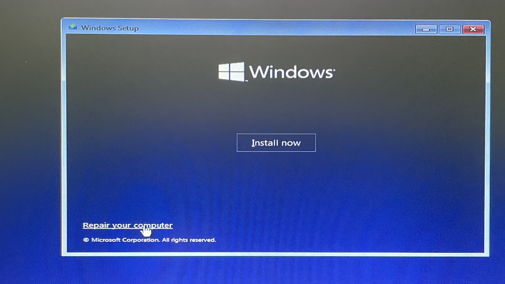
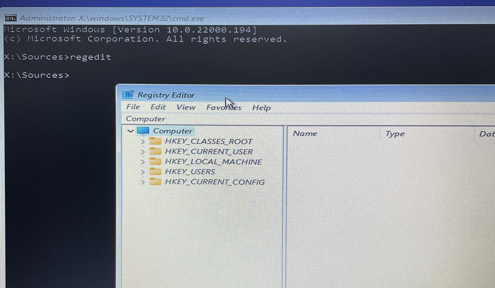
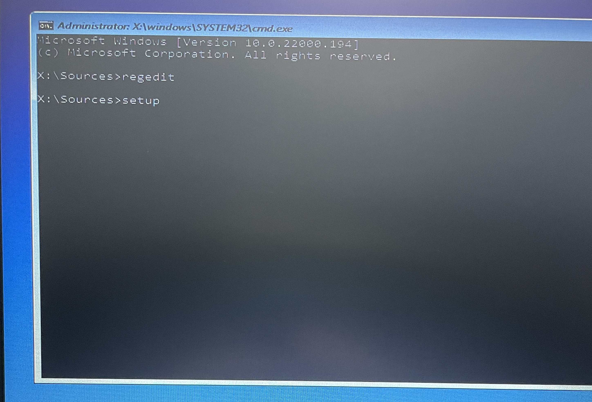

If you want to make a fresh install on Windows 11 on an older computer, you will most likely run into an error saying that Windows 11 isn't supported.
Luckily, even for a fresh install, there is still a way to get around it.

In my previous post, I have outlined [how to install Windows 11 on/from a USB drive](../windows-11-bootable-usb/).
This post is the continuation of the Windows 11 series.
So let's get started.

When you boot Windows 11 from your [bootable USB drive](../windows-11-bootable-usb/), make sure to select *repair computer* instead of *install now*.
Because if you select *install now* you will get an error saying that Windows 11 is not supported on your hardware.

In the next step select *Troubleshoot* and then select *Command Prompt*.
When you come to the command prompt, type in `regedit`, then press enter.

.

Now we are in the registry editor and we will have to make a bunch of adjustments.

## Regedit adjustments before initial Windows 11 installation

This part of this tutorial basically follows [this guide](https://appuals.com/bypass-windows-11-installation-requirements/), where we disable *Secure Boot*, *TPM* and some other checks.

Navigate to `HKEY_LOCAL_MACHINE\SYSTEM\Setup`, right click on *Setup* (in the left plane) and select `New -> Key`.
This will basically create a new 'folder' in the registry.
The name of this 'folder' should be `LabConfig`.

Right Click on `LabConfig` and select `New -> Dword (32-bit)` and name it `BypassTPMCheck`.
Open it (double click) and set the Hex value to `1`.
Create another DWORD (right click `LabConfig -> New -> Dword (32-bit)`) and name it `BypassSecureBootCheck` and set it also to `1`.

Do this a third time and create the value `BypassRAMCheck` and also set it to `1`, just like the previous examples.

The last thing we need to do is to disable the CPU check.
Navigate in regedit to `HKLM\SYSTEM\Setup\MoSetup`.
If this location does not exist, create the folder manually (via right click, `New -> Key`).

Create inside `MoSetup` another 32-bit Dword value (right click, `New -> Dword (32-bit)` and name it `AllowUpgradesWithUnsupportedTPMOrCPU` and set it to `1`, just like before.

## Windows 11 fresh install

Now comes the important part, close the regedit window, but DO NOT EXIT the command prompt (because then all the changes would be reverted).
In the command prompt type `setup` and press enter.
This will launch the Windows 11 installer from the command prompt.

Now you will see the usual setup screens for Windows 11, but this time it will not throw errors and work just fine.
I have tested this on my own hardware (Thinkpad x240, which isn't supported officially) and can confirm that Windows 11 works just perfectly.

Of course Windows 11 has some other quirks that need to be dealt with, but I plan on doing more posts about it.
