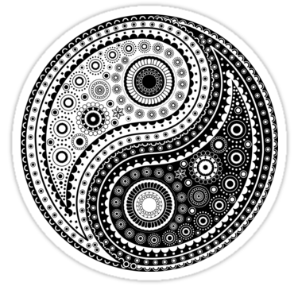
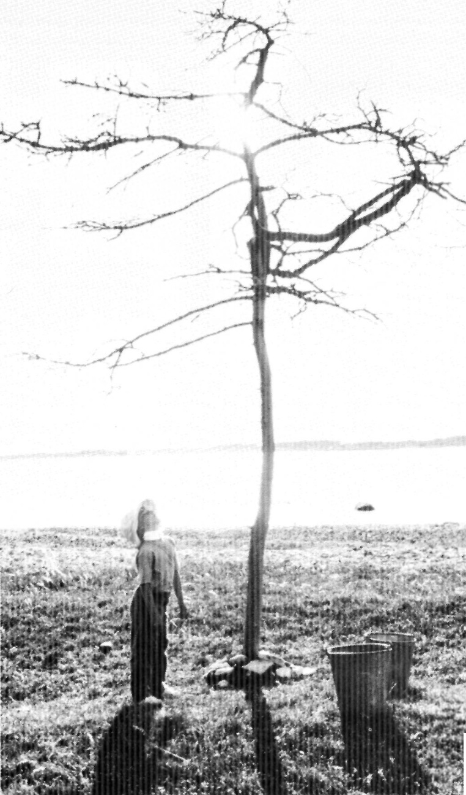

*(This page is still being worked on and is continuously being updated.)*

## Religion, Philosophy, Literature, Science

This page features the most essential and valuable writings, of course exclusively based on my opinion.
Hence this list doesn't constitute my entire library.
Links to all of the writings are provided for reference.

Please be aware that this page **is international** and contains links to literature in many different languages.

<!--
If you speak Russian there is also <a href="/ru/books/" hreflang="ru">a Russian version of this page</a> containing only literature in Russian language.
-->

### Religion

Let me preface that I am an **Russian Orthodox Christian** (**Русская Православная Церковь**).
As such the choice of the Russian translation of the bible is the *The Synodal Translation* (*Синодальный перевод Библии*), which is the translation into "regular" Russian from **Church Slavonic** (**Церковнославянский**).

Russian / Русский: *Библия* - Синодальный перевод ([pdf](bibliya.pdf), [doc](bibliya.doc), [fb2](bibliya.fb2), [epub](biblia-synodal.epub), [online](https://azbyka.ru/biblia/)).

### Philosophy

#### Taoism

Introducing Taosim is an almost impossible task (just read the first chapter of *Tao te Ching* and you will see).
All of the Taoist texts bellow are attempts at translating the untranslatable **Traditional Chinese** language.
These texts greatly shaped my own philosophy and thinking as well as my journey towards belief.
Interestingly, there are **many parallels** between this Chinese philosophy and the school of thinking of the Russian/Eastern Orthodox Church.

The translation of the most famous Taoist Writing, *Tao te Ching*, which I like most, is the German translation by Richard Wilhelm.

German / Deutsch: Laotse - *Tao Te King* ([online](https://iging.com/laotse/LaotseD.htm), [pdf](tao_te_ching_de.pdf)).

English: Lao-Tzu - *Tao te Ching* ([online](https://iging.com/laotse/LaotseE.htm), [pdf](tao_te_ching_english_paul_lin.pdf)).

This Russian version is valuable for it's explanations, especially when first approaching these texts.

Russian / Русский: Лао‑цзы - *Книга о Пути жизни (Дао‑Дэ цзин)* ([pdf](tao_te_ching_ru.pdf), [rtf](tao_te_ching_ru.rtf)).

Dutch / Nederlands: *Tau-Te-Tsjing, het boek van weg en deugd* ([pdf](tao_te_ching_j_duyvendak.pdf)).

An old Chinese text, dealing with eternal life.
When coupled with the Christian teachings of the Eastern Orthodox Church this writing becomes surprisingly clear.
Interestingly the English translation is based on the German translation (also done by Richard Wilhelm):

German / Deutsch: *Geheimnis der Goldenen Blüte (Das Buch von Bewusstsein und Leben)* ([pdf](secret_of_the_golden_flower_de.pdf)).

English: *The secret of the Golden Flower, a Chinese Book of Life* ([pdf](secret_of_the_golden_flower_en.pdf)).

One of the most famous Chinese Books ever, whilst not necessarily embodying Taoism, but definitely influenced by its school of thinking is *I Ging*.

German / Deutsch: *I Ging, Das Buch der Wandlungen* ([pdf](i_ging_de.pdf)).

#### Nietzsche

The inclusion of a work of Nietzsche on this list might seem surprising, right up until the moment when one really dives deeper into his works.
As it turns out, rather than criticising religion or *God* the problem of Nietzsche lies somewhere else.
Nietzsche's *Thus spoke Zarathustra* is a fantastic introduction to his thinking, presenting many similarities to the Bible and Lao-tzu's *Tao Te Ching*.
I might add that Nietzsche is probably one of the most misunderstood modern philosophers.

German / Deutsch: F.Nietzsche - *Also sprach Zarathustra* ([epub](nietzsche-zarathustra.epub)).

English: F.Nietzsche - *Thus spoke Zarathustra* ([pdf](zarathustra.pdf)).

### Non-fiction

The following book by Leonid Sabaneev (*Reminiscences of Scriabin*) directly influenced my interest towards the composer Alexander Scriabin.
A speciality of this book is that it is not a tedious biography but rather is a very entertaining read.
Here I am including it in the Russian language:

Russian / Русский: Л.Л.Сабанеев - *Воспоминания о Скрябине* (L.Sabaneev - *Reminiscences of Scriabin*) ([pdf](sabaneev_vospominaniya_o_scriabine_2000txt.pdf)).

For any person interested in Art I can highly recommend *Sculpting in Time* by the famous movie director Andrey Tarkovsky, here included both in Russian as well as in English.
His views on art, its connection to spirituality and religion, its role in society and some of the dangerous tendencies of modernism are an important eye opener for all people even remotely interested in Arts.
I might add in the same breath that my favourite movie of all time is his *Andrey Rublev* (*Андрей Рублёв*).

English: Andrei Tarkovsky - *Sculpting in Time* ([epub](Andrei_Tarkovsky_Sculpting_In_Time_Andrei_Tarkovsky_Sculpting_In_Time.epub), [pdf](Tarkovsky_Andrey_Sculpting_in_Time_Reflections_on_the_Cinema.pdf)).

Russian / Русский: А.А.Тарковский - *Запечатленное время* ([epub](Tarkovskiy.Andrey.Zapechatlennoe_vremya.epub)).

### Literature (fiction)

If asked what my favourite books of the fiction genre is, I would probably answer it's *The Brothers Karamazov* by Fyodor Dostoevsky.
To introduce it in a short paragraph isn't possible, but in short: This book has **everything**.
For me personally it has been of very great influence.

Russian / Русский: Ф.М.Достоевский - *Братья Карамазовы* ([epub](bratya-karamazovy-epub.epub)).

English: F.Dostoevsky - *The Brothers Karamazov* ([epub](dostoevsky-karamazov-en.epub)).

One of my favourite German writers from the period of the *Sturm und Drang* is Friedrich Schiller.
In my eyes he has a deeper intuition for human psychology, masterfully incorporated in a subliminal way and transcending the cultural clichés of his time.
His work has an Shakespearean element, and in its drama sometimes feels very "Russian".
Unsurprisingly in his *Brothers Karamazov* Dostoevsky often hints to Schiller's *The robbers* (*Die Räuber*).

German / Deutsch: F.Schiller - *Die Räuber* ([epub](schiller-rauber.epub)).

A less philosophically demanding, but definitely no less captivating read, are most of HP Lovercraft's works.
After the inclusion of all the above literature, this place on this list might seem surprising.
However, next to understanding life, books *sometimes* can also be used for entertainment, and this definitely entertainment of highest quality, while also highlighting the beauties of the English language.

English: H.P.Lovecraft - Complete Works ([epub](lovecraft_complete_works.epub)).

### Scientific

*To be added in the future*

*Page last updated on 14 Apr 2023*
