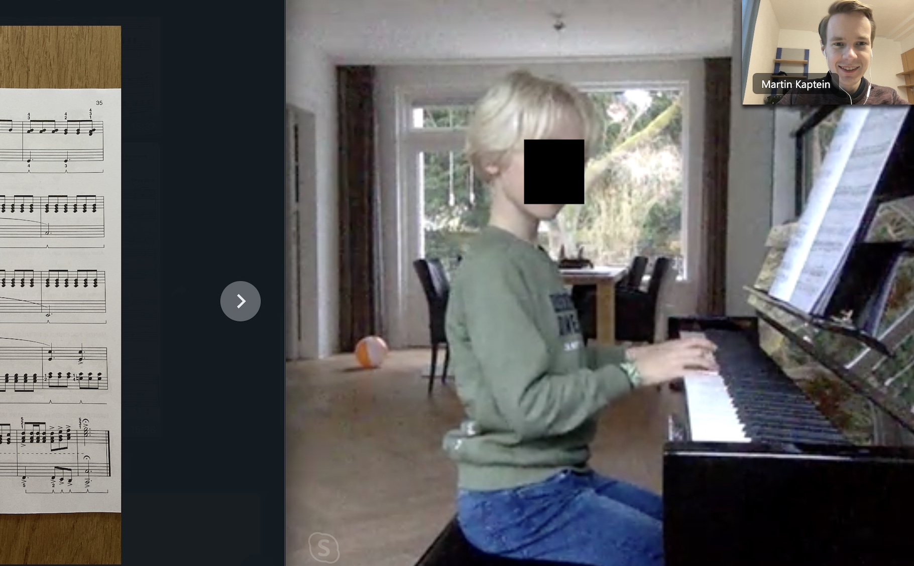
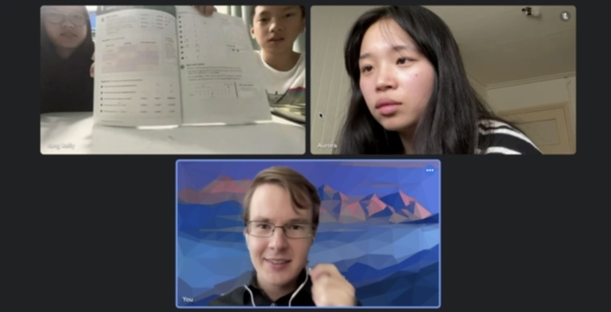
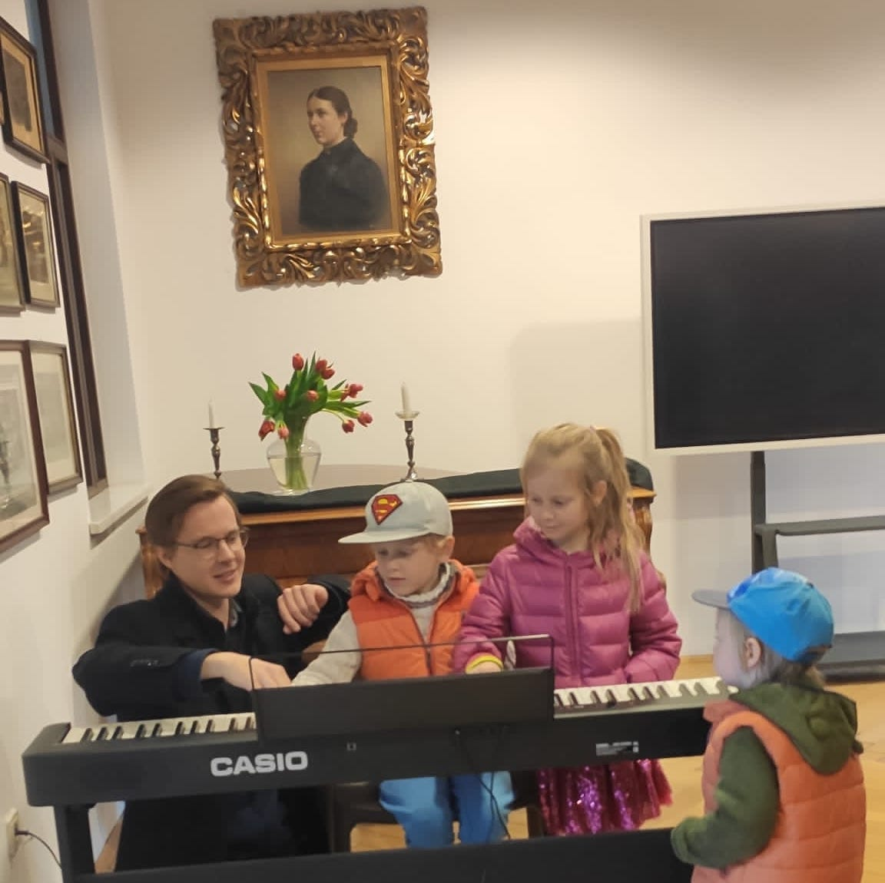
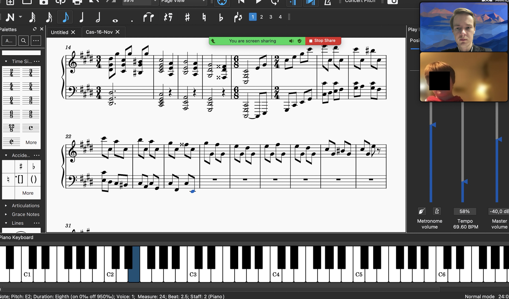
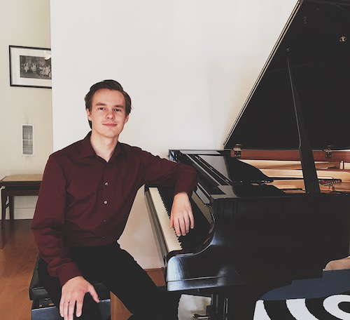

## Effectieve online pianolessen en muziektheorie onderwijs

Leren is een van de mooiste dingen in het leven.
Het ontdekken van de wereld van de muziek opent vele mogelijkheden, inzichten en ervaringen.

> Martin heeft ons bewezen dat zijn online pianolessen effectief werken. We genieten erg van onze lessen en de kinderen zijn geïnspireerd om piano te oefenen.
>
> — Susan en haar twee kinderen, Nederland.

> Met Martin hebben we eindelijk een leraar gevonden die voldoet aan onze behoeften van een professionele muziekleraar.
>
> — Catherine Wei Zhang, Singapore.

Welkom, mijn naam is Martin.
Ik ben een klassiek pianist en een ervaren muziekleraar.
Ik geef les in piano spelen en alles over muziektheorie.
Op deze pagina vind je meer informatie over mijn online lespraktijk.

## Lespraktijk

### Niveau student

De specialiteit van mijn piano en muziektheorie praktijk is dat ik les geef aan leerlingen van alle leeftijden, niveaus en achtergronden.
Mijn jongste leerling is momenteel 4 jaar oud en mijn oudste is 88 jaar oud.

Verder zijn mijn lessen geschikt voor zowel beginners als gevorderden.
Mijn lessen zijn zowel mogelijk als individuele lessen als groepslessen.

### Lesonderwerpen

Op het gebied van **Pianospelen** geef ik les in:

- Klassiek Pianospel
- Grondbeginselen van Jazz Harmonie en improvisatie

Op het gebied van **Muziektheorie** geef ik les in de volgende onderwerpen:

- Solfège, zang en gehoortraining
- Muzieknotatie, harmonie en analyse
- Geschiedenis van muziek
- Muzikale compositie

#### Officiële kwalificaties en voorbereiding op examens

In mijn muziekpraktijk werk ik tevens met officiële toelatingsexamens en curricula als doel.

Als het doel bijvoorbeeld is om een student voor te bereiden op een toelatingsexamen voor een conservatorium of op een [ABRSM examen](https://gb.abrsm.org/en/our-exams/music-theory-exams/), dan ondersteun ik in mijn praktijk het hele traject daar naartoe, om de beste resultaten te garanderen.

#### Professionele ondersteuning

Een professionele aanpak is altijd gegarandeerd.
De exacte details van het gekozen leertraject hangen af van het doel van de leerlingen.
Dit wordt aan het begin van de lessen besproken.

Er is altijd flexibiliteit in ondersteuning, mocht een leerling plotseling ergens hulp bij nodig hebben, ook als het niet tijdens de les is.

#### Talen

<!---->

Een voordeel van mijn praktijk is dat ik les geef in een groot aantal talen.
Momenteel geef ik les in het:

- Engels
- Russisch
- Duits
- Nederlands
- Italiaans

### Hoe mijn online lessen werken

Toen ik met mijn pianopraktijk begon, stonden veel mensen sceptisch tegenover het idee van online lessen, wat heel begrijpelijk is.
Ik ontdekte echter hoe ik zelfs online lessen effectief kan laten werken:

Het geheim ligt in het vermogen om zeer complexe onderwerpen, bijvoorbeeld pianotechniek (bijv. handpositie, gebruik van de vingers), op te splitsen in kleine onderdelen die gemakkelijk te begrijpen en over te brengen zijn.
Omdat ik ingewikkelde onderwerpen heel duidelijk overbreng, werkt dit ook online heel goed.

Voor muziektheorie werken online lessen zelfs beter dan fysieke lessen:
We kunnen samenwerken, informatie delen op whiteboards, luisteren naar opnames, direct bladmuziek schrijven en beluisteren, het pianoklavier verkennen en nog veel meer.
Op de foto hieronder geef ik les aan een van mijn jonge leerlingen, die zijn eigen composities wil opschrijven:

*Een compositie schrijven met een leerling.*

#### Flexibiliteit en repertoire

Naast de flexibiliteit in tijd en planning die online lessen bieden, sta ik ook altijd open voor ideeën van leerlingen:
Als de leerling eigen interesses of ideeën heeft, pas ik me daar graag op aan.
Else Ik heb veel ervaring met het kiezen van interessante en boeiende muziekstukken en onderwerpen.

## Over mij

Ik heb veel ervaring met pianospelen.
In mijn leven heb ik veel professionele pianoconcoursen en internationale muziekfestivals gedaan met bekende figuren uit de muziekwereld.
Daarnaast kom ik uit een achtergrond van de beroemde Russische Pianoschool, waarin veel aandacht is voor muzikaliteit en persoonlijkheid.

In de loop der jaren heb ik mijn eigen pianotechniek ontwikkeld met de focus op ontspanning.
Dit maakt virtuositeit mogelijk.

Als je wilt zien hoe ik piano speel, kun je [enkele van mijn opnames op deze pagina bekijken](/media/).
Of voel je vrij [om te lezen over mijn muzikale carrière op deze pagina](/piano/).

### Filosofie van het lesgeven

De filosofie van mijn lessen is om vooral te werken aan de individualiteit van de persoonlijkheid van de uitvoerder, en om met interessante en boeiende muziekstukken te werken aan artistieke, muzikale en technische eigenschappen.
**De muziek komt altijd op de eerste plaats!**

## Neem contact op voor een afspraak

Neem contact met mij op via E-Mail:

[mk@sonata8.com](mailto:mk@sonata8.com)

Voel je vrij om alvast wat informatie over jezelf toe te voegen.

Je kunt ook contact met me opnemen via een van de volgende sociale netwerken:

[Instagram](https://www.instagram.com/martinkaptein/), [Telegram](https://t.me/martinkaptein), [Twitter](https://twitter.com/MartinKaptein), [YouTube](https://www.youtube.com/@martinkaptein): **@martinkaptein**
