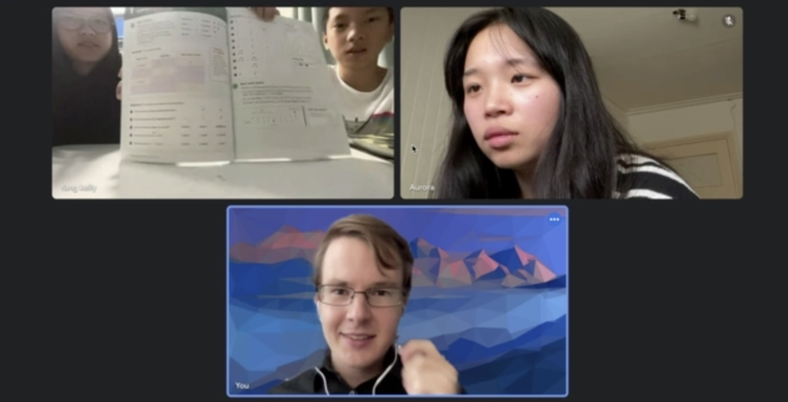
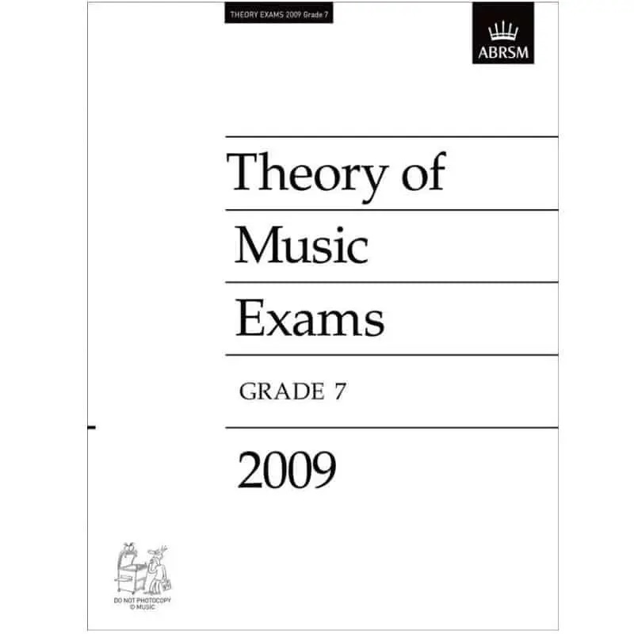
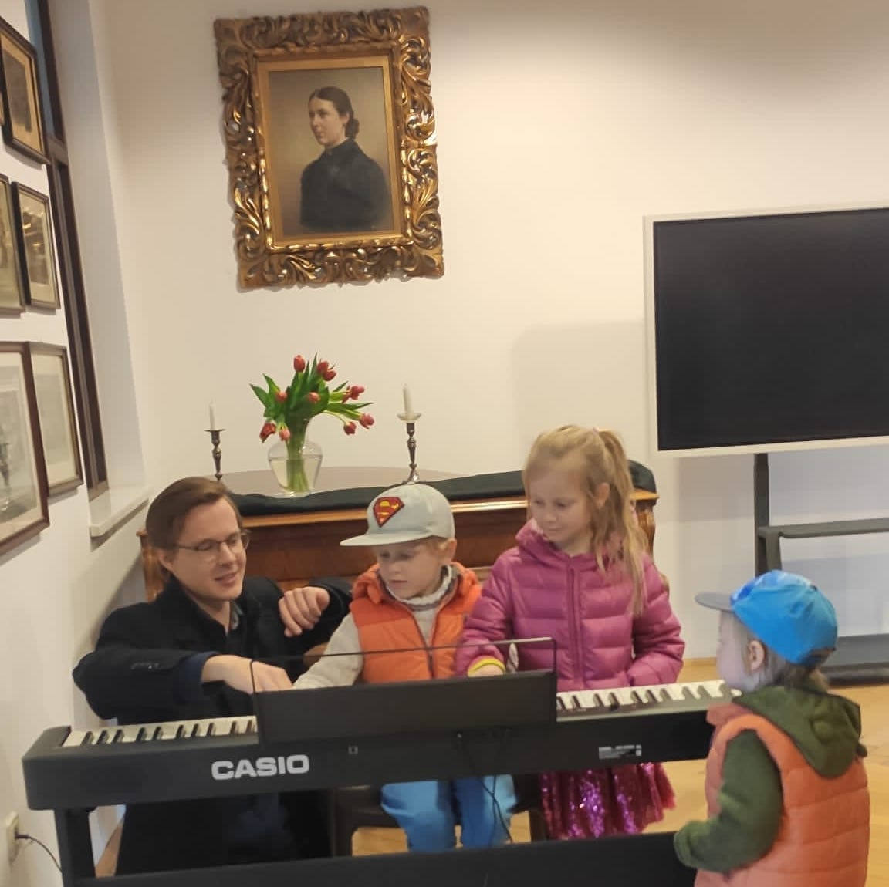
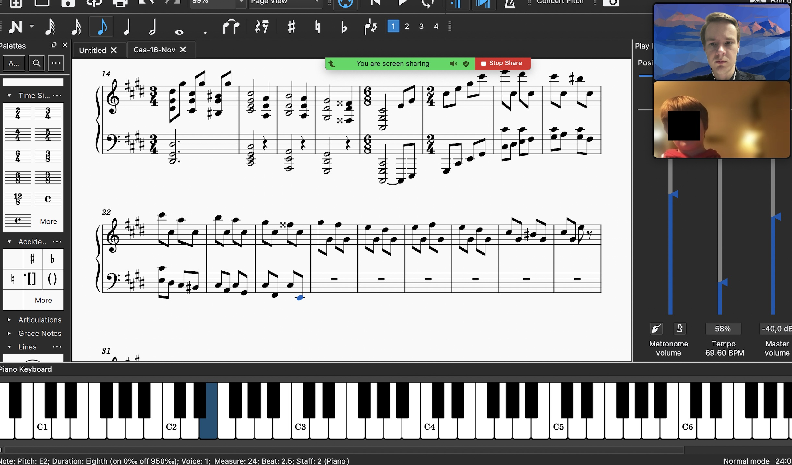
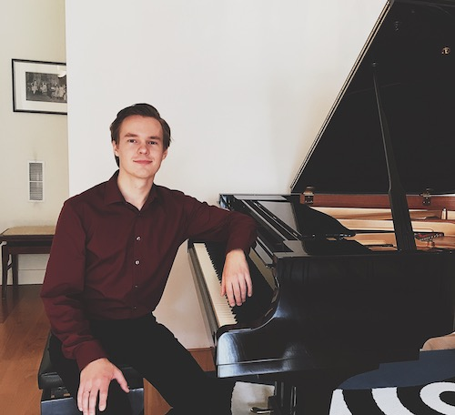

## Эффективные онлайн-уроки игры на фортепиано и обучение теории музыки

Учиться - одно из самых прекрасных занятий в жизни.
Знакомство с миром музыки открывает множество возможностей, открытий и переживаний.

> Мартин доказал нам, что его онлайн-уроки игры на фортепиано работают эффективно. Мы получаем огромное удовольствие от наших занятий, а дети вдохновлены заниматься фортепиано.
>
> > — Сьюзан и ее двое детей, Нидерланды.

> С Мартином мы наконец-то нашли преподавателя, который отвечает нашим потребностям в профессиональном музыкальном педагоге.
>
> > — Катрин Вэй Чжан, Сингапур.

Добро пожаловать, меня зовут Мартин.
Я классический пианист и опытный преподаватель музыки.
Я обучаю игре на фортепиано и теории музыки.
На этой странице вы найдете больше информации о моей практике преподавания онлайн.

## Практика преподавания

### Уровни учеников

Особенностью моей практики игры на фортепиано и теории музыки является то, что я преподаю студентам любых возрастов, уровней и подготовки.
Моему самому младшему ученику сейчас 4 года, а самому старшему - 88 лет.

Кроме того, мои уроки подходят как для начинающих, так и для продвинутых студентов.
Мои уроки возможны как индивидуальные, так и групповые.

### Предметы преподавания

В области **Игры на фортепиано** я преподаю:

- Классическая игра на фортепиано
- Основы джазовой гармонии и импровизации

В области **Теория музыки** я преподаю следующие предметы:

- Сольфеджио, пение и тренировка слуха
- Музыкальная нотация, гармония и анализ
- История музыки
- Музыкальная композиция

#### Официальные квалификации и подготовка к экзаменам

В своей музыкальной практике я работаю с учетом официальных вступительных экзаменов и учебных программ.
Например, если целью является подготовка к вступительному экзамену в консерваторию или к экзамену [ABRSM](https://gb.abrsm.org/en/our-exams/music-theory-exams/), я поддерживаю весь процесс подготовки к нему в своей практике, чтобы гарантировать наилучшие результаты.

#### Профессиональная поддержка

Профессиональный подход всегда гарантирован.
Точные детали выбранного пути обучения зависят от цели учеников.
Это обсуждается в начале наших занятий.
Всегда есть гибкая поддержка, если студенту вдруг понадобится помощь, даже если это не во время урока.

#### Языки

<!---->

Преимуществом моей практики является то, что я преподаю на разных языках.
В настоящее время я преподаю на:

- английском
- русском
- немецком
- голландском

### Как происходят мои онлайн-уроки

Когда я начинал практиковать обучение игре на фортепиано, многие люди скептически относились к идее онлайн-уроков, что вполне понятно.
Однако я обнаружил, как сделать так, чтобы даже онлайн-уроки работали эффективно:

Секрет заключается в умении разбить очень сложные темы, например, фортепианную технику (например, положение рук, использование пальцев), на маленькие части, которые легко понять и донести до ученика.
Поскольку я излагаю сложные темы очень понятно, это очень хорошо работает и в режиме онлайн.

Для теории музыки онлайн-уроки работают даже лучше, чем физические уроки:
Мы можем сотрудничать, обмениваться информацией на интерактивных досках, слушать записи, непосредственно писать и слушать ноты, изучать клавиатуру фортепиано и многое другое.
На картинке ниже я обучаю одного из моих юных учеников, который хочет записывать свои собственные композиции:

*Написание композиции с учеником.*

#### Гибкость и репертуар

Помимо гибкости во времени и планировании, которую обеспечивают онлайн-уроки, я также всегда открыт для идей студентов:
Если у ученика есть собственные интересы или идеи, я с удовольствием подстроюсь под них.
У меня также есть богатый опыт выбора интересных и увлекательных музыкальных произведений и тем.

## Обо мне

У меня большой опыт игры на фортепиано.
В моей жизни я участвовал во многих профессиональных фортепианных конкурсах и международных музыкальных фестивалях с известными представителями музыкального мира.
Кроме того, я происхожу из знаменитой русской фортепианной школы, в которой большое внимание уделяется музыкальности и личному развитию.

С годами я разработал собственную фортепианную технику, в которой основное внимание уделяется релаксации рук.
Это делает возможной профессиональную свободу игры.

Если вы хотите посмотреть, как я играю на фортепиано, вы можете [посмотреть некоторые из моих записей на этой странице](/media/).
Приглашаю [прочитать о моей музыкальной карьере на этой странице](/piano/).

### Философия преподавания

Философия моих уроков заключается в работе, прежде всего, над индивидуальностью личности исполнителя, а также в работе с интересными и увлекательными музыкальными произведениями над художественными, музыкальными и техническими качествами.
**Музыка всегда на первом месте!**

## Свяжитесь со мной для предварительной встречи

Свяжитесь со мной по E-Mail:

[martin@martinkaptein.com](mailto:martin@martinkaptein.com)

Если желаете можете указать некоторую информацию о себе.

Вы также можете связаться со мной в одной из следующих социальных сетей:

[Инстаграм](https://www.instagram.com/martinkaptein/), [Телеграм](https://t.me/martinkaptein), [Твиттер](https://twitter.com/MartinKaptein), [Ю-Туб](https://www.youtube.com/@martinkaptein): **@martinkaptein**

