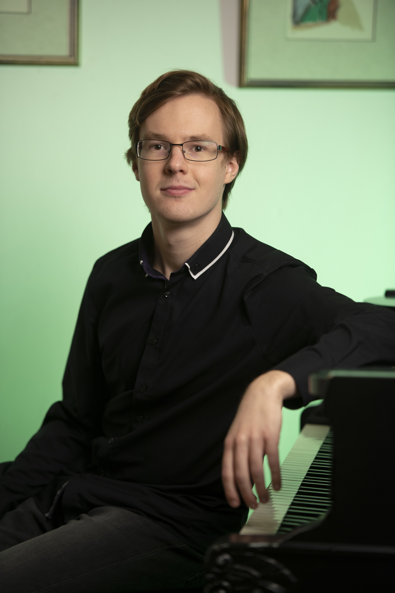

[Media, Recordings, Pictures](/media/)

<!-- Add below to PDF version -->

# Martin Kaptein - Pianist, Educator

## Biography

The pianist Martin Kaptein, who originally comes from the Netherlands and currently resides in Bolzano, Italy, has next to music also the passion for philosophy.

One of Martin's projects that unites music and philosophy is the [Scriabin Club](https://scriabinclub.com/).
The aim of Scriabin Club is to create a community where conversations about art and life take place and like-minded people are brought together.
In addition, the creation of a music school and learning environment of the highest quality for piano lessons and general cultural education is central.

Martin comes from a background of the Russian Piano School, which is well known for its approach to musical sensitivity.
He studied with famous teachers as Michail Markov (RU), Elena Golovinskaya (RU), Frank van de Laar (NL), Vitaly Samoshko (UA) and Alessandra Brustia (IT).

In November 2022 Martin collaborated with the Scriabin Society of America in organization of a festival commemorating Scriabin's 150th anniversary.
Martin won the first prize in the famous "St. Cecilia International Piano competition" in Porto, Portugal in 2015, for which he was re-invited for solo-recitals in the consecutive years.
In 2019 together with his trio, Martin won the chamber music competition of the ArtEZ conservatory in Zwolle.

Martin himself is also a piano and music theory teacher, and sees himself as an educator in a wider sense of this word.
He has also interest in a wide range of cultures and speaks many languages.

## Detailed Artistic CV

### Studies and Degrees

- From age of 5 private piano lessons with Elena Golovinskaya.
- 2008 to 2015 Gymnasium (general qualification for university entrance (=Abitur)) with average grade of 1,8, Missionsgymnasium St.Antonius Bardel, Germany.
- 2015 - 2020 Bachelor Classical Music Performance Piano, ArtEZ conservatory, The Netherlands, teachers Michail Markov and Frank van de Laar.
- 2020 - 2022 Masters of Music, Fontys conservatory Tilburg, the Netherlands, teacher Vitaly Samoshko.
- 2022 - Bolzano conservatory, Italy.

### Competitions and Prizes

- 2010 3rd prize "International Piano Competition" in Enschede, The Netherlands
- 2012 2nd prize international EPTA competition in Belgium. 
- 2012 1st prize "International piano competition virtuosi per Musica di Pianoforte" in the Czech Republic.
- 2015 1st prize in de "St. Cecilia International Pianocompetition" in Porto, Portugal. 
- 2016 first price Vught klassiek competition in the Netherlands
- 2017 first price Ulvenhart klassiek competition in the Netherlands
- 2017 first price International Music festival in Loutraki, Greece
- 2017 Publieksprijs VriendenCultuurPrijs (price of public), Tilburg
- 2019 first price chamber music competition, Zwolle, The Netherlands
- 2020 finalist Grachtenfestival in Amsterdam, The Netherlands
- 2022 Winner Fontys (Tilburg) conservatory competition.

### Masterclasses and Festivals

- 2013 "International Music Festival" in Rhodos, Greece
- 2014 "International Music Academy" in Cremona, Italy 
- 2015 Muziekfestival Hernen, The Netherlands
- 2016 "International Piano Festival" in Duzsniky, Poland
- 2017 "International Music Festival" in Athens, Greece
- 2019 Zomerfestival, Helvoirt, The Netherlands
- 2021 Fleisher Winter Academy Baltimore Piano Festival
- 2021 11th International Piano Masterclasses, Katowice, Poland
- 2021 Feuerwerk Piano Academy, Einbeck, Germany
- 2022 PianoLab, Belgium
- 2022 Online Scriabin 150 Festival in collaboration with the Scriabin Society of America

### Other experiences, interests and hobbies

- Teaching and Educating
- Chamber music, accompanist
- [Technology and IT](/tech/)
- Literature 
- Philosophy
- Languages (English, Dutch, German, Russian, Italian)
- Working together with people
- Sports

*Updated 20 Feb 2023*
