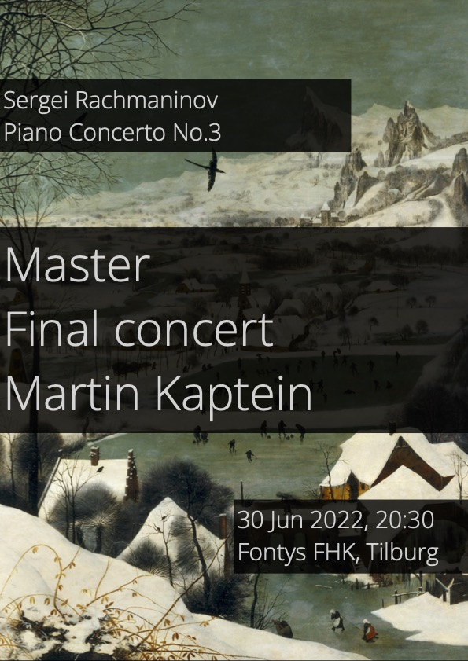

Am 30. Juni 2022 legt Martin Kaptein seine Abschlussprüfung für sein Master of Music-Diplom ab.

Die Veranstaltung findet im Saal A0.16 des Fontys-Konservatoriums in Tilburg statt und beginnt um 20:30 Uhr.
Die Adresse ist: *Zwijsenplein 1, Tilburg*.

Auf dem Programm stand das dritte Klavierkonzert von Rachmaninoff, gespielt auf 2 Flügeln mit Martins Lehrer Vitaly Samoshko.

## Rückblick

Das Examen wurde mit dem Prädikat *cum laude* ausgezeichnet. 
Hier ein kurzer Auszug aus der Prüfung:

<video width="320" height="240" controls> <source src="/images/rach-3-mk.mp4" type="video/mp4">Dein Browser unterstützt das Video-Tag nicht.</video>
