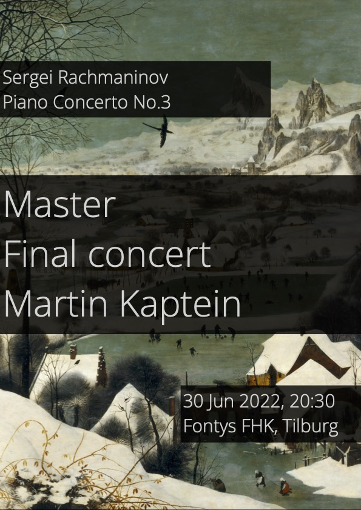

30 июня 2022 года Мартин Каптейн сдал выпускной экзамен на получение диплома магистра музыки.

Мероприятие состоялось в зале A0.16 консерватории Fontys в Тилбурге и началось в 20:30.
Адрес: *Zwijsenplein 1, Tilburg*.

В программе был третий фортепианный концерт Рахманинова, исполненный на двух фортепиано с преподавателем Мартина Виталием Самошко.

## Взгляд назад

Экзамен был сдан с отличием *cum laude*. 
Приводим небольшой отрывок из экзамена:

<video width="320" height="240" controls> <source src="/images/rach-3-mk.mp4" type="video/mp4">Ваш браузер не поддерживает тег video.</video>
