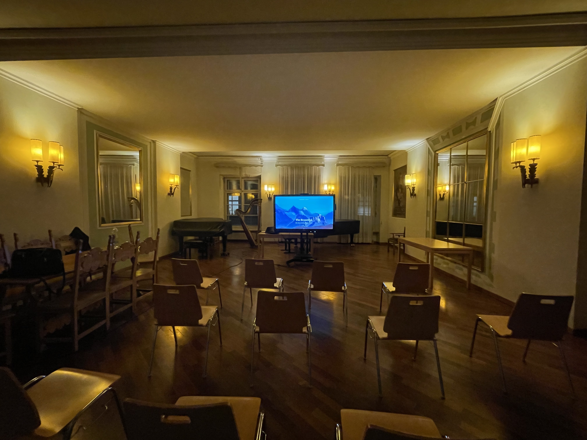

On January 30th 2023, the Dutch Pianist Martin Kaptein held a lecture in the conservatory of Bolzano, Italy.
This was done as part of the Scriabin Club initiative.
[Read more about this event on the Website of the Scriabin Club here](https://scriabinclub.com/post/about-the-beautiful/).

The topic of the lecture was: *The importance of (re-)discovering the beautiful*.

You can also find [the full lecture on YouTube](https://www.youtube.com/watch?v=3-IlPgdl5hs).
