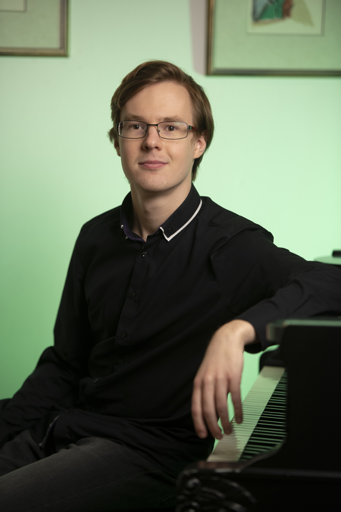

[Aufnahmen und Bilder](/media)

<!-- Add below to PDF -->

## Biografie von Martin Kaptein

Der aus den Niederlanden stammende Pianist und Musiker Martin Kaptein hat neben Musik auch die Vorliebe für Philosophie.

Eines von Martins Projekten die Musik und Philosophie miteinander vereinigen ist der [Skrjabin Klub](https://scriabinclub.com/de/).
Dieser Skrjabin Klub hat als Zielsetzung die Schaffung einer Gemeinschaft, in der Gespräche über Kunst und Leben stattfinden und Gleichgesinnte zusammengebracht werden.
Zusätzlich steht das Schaffen einer Musikschule und eines Lernumfelds von höchster Qualität für Klavierunterricht und allgemeine kulturelle Bildung zentral.

Martin hat an vielen Klavierwettbewerben und Meisterkursen teilgenommen wie zum Beispiel:
Im Jahr 2015 gewann Martin den ersten Preis beim berühmten "St. Cecilia International Piano Competition" in Porto, Portugal, für den er in den darauffolgenden Jahren erneut zu Solokonzerten eingeladen wurde.
Im Jahr 2019 gewann Martin mit seinem Trio den Kammermusikwettbewerb des ArtEZ-Konservatoriums in Zwolle in den Niederlanden.
2021 wurde Martin zur exklusiven "Feuerwerk"-Klavierakademie in Einbeck, Deutschland, eingeladen.

Martin studierte bei renommierten Musikern und Lehrern wie Mikhail Markov (RU), Elena Golovinskaya (RU), Frank van de Laar (NL), Vitaly Samoshko (UA) und Alessandra Brustia (IT).

Martin ist auch selbst leidenschaftlicher Klavierlehrer und versteht sich als Pädagoge im weiteren Sinne des Wortes.

## Lebenslauf (En)

<!-- basically copy from english page -->

### Studies and Degrees

- From age of 5 private piano lessons with Elena Golovinskaya.
- 2008 to 2015 Gymnasium (general qualification for university entrance (=Abitur)) with average grade of 1,8, Missionsgymnasium St.Antonius Bardel, Germany.
- 2015 - 2020 Bachelor Classical Music Performance Piano, ArtEZ conservatory, The Netherlands, teachers Michail Markov and Frank van de Laar.
- 2020 - Masters of Music, Fontys conservatory Tilburg, the Netherlands, teacher Vitaly Samoshko.

### Competitions and Prizes

- 2010 3rd prize "International Piano Competition" in Enschede, The Netherlands
- 2012 2nd prize international EPTA competition in Belgium. 
- 2012 1st prize "International piano competition virtuosi per Musica di Pianoforte" in the Czech Republic.
- 2015 1st prize in de "St. Cecilia International Pianocompetition" in Porto, Portugal. 
- 2016 first price Vught klassiek competition in the Netherlands
- 2017 first price Ulvenhart klassiek competition in the Netherlands
- 2017 first price International Music festival in Loutraki, Greece
- 2017 Publieksprijs VriendenCultuurPrijs (price of public), Tilburg
- 2019 first price chamber music competition, Zwolle, The Netherlands
- 2020 finalist Grachtenfestival in Amsterdam, The Netherlands

### Masterclasses and Festivals

- 2013 "International Music Festival" in Rhodos, Greece
- 2014 "International Music Academy" in Cremona, Italy 
- 2015 Muziekfestival Hernen, The Netherlands
- 2016 "International Piano Festival" in Duzsniky, Poland
- 2017 "International Music Festival" in Athens, Greece
- 2019 Zomerfestival, Helvoirt, The Netherlands
- 2021 Fleisher Winter Academy Baltimore Piano Festival
- 2021 11th International Piano Masterclasses, Katowice, Poland
- 2021 Feuerwerk Piano Academy, Einbeck, Germany
- 2022 PianoLab, Belgium
- 2022 Online Scriabin 150 Festival in collaboration with the Scriabin Society of America
